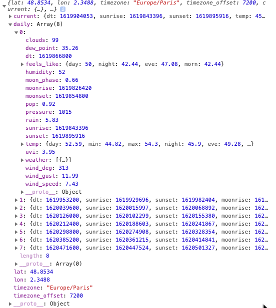

# 06 A Weather App
Simple weather app that fetches data based on user location or user input. It also stores previous location in local storage.

## See it in action
> See the live app here: https://acevezl.github.io/challengesix/


## Table of contents

* [App Logic](#App-logic)
* [Retrieving user location](#Retrieving-user-location)
* [Getting weather by coordinates](#Getting-weather-by-coordinates)
* [Painting current weather and forecast on the screen](#Painting-current-weather-and-forecast-on-the-screen)
* [Fetching user-entered city or zip](#Fetching-user-entered-city-or-zip)
* [Toggle between imperial and metric units](#Toggle-between-imperial-and-metric-units)
* [Storing previously searched locations](#Storing-previously-searched-locations)

### App logic
The functionality of this app is dividied in three main topics:

1. Retrieving the user location
2. Storing and retrieving previous searched locations 
3. Fetching and displaying weather

At the highest level, the premise of the application gravitates around the following user story:
``` 
AS A traveler
I WANT TO see the weather in my current location and other locations
SO THAT I can plan my day
```
This weather app will use Javascript _geoLocation_ to retrieve the user's location and, if allowed by the user, utilize these coordinates to _paint_ the current weather and forecast.

Optionally, users can perform a search by city or zip code. The resulting weather and forecast will be displayed on the screen, while the location will be stored in _localStorage_.

Additional UI components are:
* Allow users to switch between Imperial and Metric (toggle).
* Present a list of popular cities for users to run additional queries.
* Show weather icons based on the weather conditions returned on the selected location.

### Retrieving user location
In my honest opinion, a good place to start when pulling weather is on the user's location. Essentially, we want to present "The weather around me".

To retrieve the user locations, I'm using the HMTL Geolocation API. First, I've created an object called _currentLocation_ to store the user's current (or currently selected) location.
```
// Default location is San Jose
var currentLocation = {
    lat: 37.3394,
    lon: -121.895
}
```
The default location is my home town. This is done so that if users don't approve sharing their location, a default is painted. Why? Because _quite frankly_ no ones wants to load a page with blank or missing fields.

The location retrieval itself is extremely straighforward: call the HTML Geolocation API, get the coordinates and store them in our currentLocation object. Once that's done, we simply get the weather by the user's location (coordinates) and _paint_ the weather in the screen:

```
function getGeoLocation(){
    if (navigator.geolocation) {
        navigator.geolocation.getCurrentPosition(showPosition);
    } else {
        console.log("Geolocation is not supported by this browser.");
    }
}

function showPosition(position) {
    currentLocation.lat = position.coords.latitude;
    currentLocation.lon = position.coords.longitude;
    getCurrentWeatherByCoordinates(currentLocation);
}
```

### Getting weather by coordinates
This is the core of the app. The API used is [OpenWeather](https://openweathermap.org/api), which has several retrieval methods to get detail wetaher data. The main two methods used in this app are:
* **/weather** : To retrieve basic current weather (and Location Name)
* **/onecall** : To retrieve full weather deatils, including daily forecats for the next 7 days

The method I've created simply calls the first end point and nests the second to gather the full forecast details based on _currentLocation_ - which, as stated above contains either the user location or the location selected by the user (or the default San Jos&eacute; location, my hometown).
```
function getCurrentWeatherByCoordinates() {
    fetch(
        'https://api.openweathermap.org/data/2.5/weather?lat='
        +currentLocation.lat+'&lon='+currentLocation.lon+
        '&appid=[API Key]'
    )
    .then(function(weatherResponse) {
        return weatherResponse.json();
    })
    .then(function(weatherResponse){
        storeWeatherData(weatherResponse);
        return fetch(
            'https://api.openweathermap.org/data/2.5/onecall?lat='
            +currentLocation.lat+'&lon='+currentLocation.lon+
            '&units='+units+'&exclude=minutely,hourly&appid=[API Key]'
        )
        .then(function(weatherResponse) {
            return weatherResponse.json();
        })
        .then(function(weatherResponse){
            paintCurrentWeather(weatherResponse);
            return weatherResponse;
        });
    });
}
```
With the data retrieved, I'm calling a method called _paintCurrentWeather_ which in turn will call _printForecast_ so that all relevant information is displayed to the user.

### Painting current weather and forecast on the screen
The method I've wrote is called _paintCurrentWeather_ which receives a parameter called _weather_, which in turn is an object containing all current and forecast data.

This _weather_ object contains key datapoints like:
* Weather icon - A code that indicates which image to display.
* Location name - The human-friendly name of the user location (i.e. San Jose).
* Current weather details - Such as current temperature, min temp, max temp, UV index, humidity, etc.
* Daily forecast for the next 7 days, including the current date.

Using _Bootstrap_ I'm creating _cards_ to display not only the current weather, but also the forecast (on which I use nested cards). The code is very self-explanatory, but here are a couple examples:

```
function paintCurrentWeather(weather) {
    
    [...]
    
    // Update current weather icon
    var cardImageEl = document.querySelector('#weather-icon');
    cardImageEl.setAttribute('src','./assets/images/' + weather.current.weather[0].icon + '.png');
    cardImageEl.className = 'card-img-top';
    
    // Update the location name
    var locationEl = document.querySelector('#location');
    locationEl.innerText = locationName;
    
    // Update the temperature
    currentTemperature = weather.current.temp;
    var currentTempEl = document.querySelector('#current-temp');    
    currentTempEl.innerText = Math.round(currentTemperature) + '° ' + tempScale;
    
    [...]
    
    printForecast(weather);
}
```
It's worth mentioning that the _date_ value returned by OpenWeather is a UNIX timestamp, that needs to be decoded into a human friendly format:

```
    [...]
    // Show date on card - Need to finagle the unix timestamp to date
    var currentDate = new Date(weather.current.dt*1000);
    var currentDateEl = document.querySelector('#current-date');
    currentDateEl.innerText = currentDate.toLocaleDateString('en-US',
    {weekday: 'short', year: 'numeric', month: 'short', day: 'numeric', hour: '2-digit', minute:'2-digit'});
    [...]
```

Now to print the forecast, we have to first understand the structure of the OpenWeather response. Within the weather object, there is a property called _daily_ which contains an array of objects with 7 days of data. The first element, _daily[0]_ contains the ucrrent day, while _daily[1 - 7]_ contain the next days:



On the _printForecast_ method, I'm simply iterating over the _daily[]_ array and creating cards to show the data (I know the assignment was to show the next 5 days, but... I didn't want to leave that last day orphaned... since I have it already, why not show it!?!)
```
function printForecast(weather) {
    // Now print the next six days of forecast
    var forecastPanel = document.querySelector('#forecast');
    forecastPanel.innerHTML = '';
    
    for (var i=1; i<weather.daily.length-1; i++) {
        var forecastCard = document.createElement('div');
        forecastCard.className = 'card m-1 shadow';

        var forecastIcon = document.createElement('img');
        forecastIcon.className = 'card-img-top';
        forecastIcon.setAttribute('src', './assets/images/'+weather.daily[i].weather[0].icon + '.png');

        var forecastDetails = document.createElement('div');
        forecastDetails.className = 'card-img-overlay text-light';
        [...]
        // Logic to add the rest of the data points goes here
        // Add the newly created card to the parent forecast card
        [...]
    }
}
```
### Fetching user-entered city or zip
Users may enter a city or zip code on the search bar. I've added an event listener to call a function that will retrieve the weather based on that _search query_.
```
function initialize() {
    [...]

    // Add event listener to search bar
    var searchBar = document.querySelector('#search-button');
    searchBar.addEventListener('click', getCurrentWeatherBySearch);

    [...]
}
```
Note that I've called the parameter _city_ but that's a big fat lie... In reality this variable contains a _search query_ - It may be a city, a zip, a country, anything to the user's heart's content.
```
function getCurrentWeatherBySearch (target) {
    target.preventDefault();
    var city = target.srcElement.previousElementSibling.value;
    getCurrentWeatherByQuery(city);
}
```
The method _getCurrentWeatherByQuery_ is a rehash of my original _getCurrentWeatherByCoordinates_ the difference is that now we don't have a location with latitude and longitude, but an actual search query.

> And because we are getting user's input - we may get garbage (i.e. a location name that doesn't exist, or any random string entered by the user). Therefore we got to catch those errors - See the try and catch block, along with the fetch.then.catch structure when calling the API.

```
function getCurrentWeatherByQuery(q) {
    try {
        fetch(
            'https://api.openweathermap.org/data/2.5/weather?q='+q+
            '&appid=655d5689eeeddab12919a0a91fabf64a'
        )
        .then(function(weatherResponse) {
            return weatherResponse.json();
        })
        .then(function(weatherResponse){  
            storeWeatherData(weatherResponse);
            return fetch(
                'https://api.openweathermap.org/data/2.5/onecall?lat='+currentLocation.lat+'&lon='+currentLocation.lon+
                '&units='+units+'&exclude=minutely,hourly&appid=655d5689eeeddab12919a0a91fabf64a'
            )
            .then(function(weatherResponse) {
                return weatherResponse.json();
            })
            .then(function(weatherResponse){
                paintCurrentWeather(weatherResponse);
                return weatherResponse;
            })
            .catch(function(error) {
                console.log('This is from the inside fetch catch' + error);
                reportLocationNotFound();
            });
        })
        .catch(function(error) {
            console.log('This is from the outside fetch catch' + error);
            reportLocationNotFound();
        });
    } catch (error) {
        console.log('This is from the try catch' + error);
        reportLocationNotFound();
    }
}
```
Since we are retrieving the exact same object every time, we can reuse _paintCurrentWeather_ and just pass the weather object. Less code makes Arnaut a happy boy!

### Toggle between imperial and metric units
Unfortunately - the USA still uses an archaic and obscure unit scale that assigns numbers based on feelings, sorcery and, I suspect, FREEDOM... So I can't simply show the units in metric, like a normal human. Therefore, I'm adding a toggle for users to go back and forth.

(Yes, I'm aware I'm initially pulling in Imperial, then letting the user decide... The irony...).

The trick is - when this toggle is pushed, the following method is called:

```
function switchTemperatureUnits() {
    var switchUnitsBtn = document.querySelector('#switch-temp');

    if (units === 'imperial') {
        tempScale = 'C';
        units = 'metric';
        speedScale = 'm/s';
        switchUnitsBtn.innerText = 'Switch to imperial';
    } else {
        tempScale = 'F';
        units = 'imperial';
        speedScale = 'mph';
        switchUnitsBtn.innerText = 'Switch to metric';
    }
    // Here's where the magic happens!
    getCurrentWeatherByCoordinates(currentLocation);
}
```
Because I always store the _currentLocation_ and the units in global variables, I just have to swap the units and call my trusty _getCurrentWeatherByCoordinates_ method. I will simply fetch and paint the weather that is already being displayed, but with the toggled units.

### Storing previously searched locations
The final trick of this app is to always stor every location searched. In fact, I'm also storing all previous locations, this means that I _push()_ the last location into an array that I use to display on the screen. 

Technically I could store ALL locations - but the UI will suffer if I do so. For that reason, I'm capping the list of previous locations to 10.

Here are the three methods I use:

>When I pull any location's weather:
```
function addPreviousCity() {
    previousLocations.push(locationName);
    printPreviousCities();
}
```
>When the user selects a previously searched location - I remove it from the array, so that when the weather is painted, it gets added at the end of the array.

This prevents previuos locations from displaying twice in the screen
```
function removePreviousCity(index) {
    previousLocations.splice(index, 1);
    printPreviousCities();
}
```
>When the previous locations list passes 10 cities, I snip the oldest searched city (basically shift the array by one so that the element on position 0 goes bye bye). 
```
function removeOldestCity() {
    previousLocations.shift();
    printPreviousCities();
}
```

